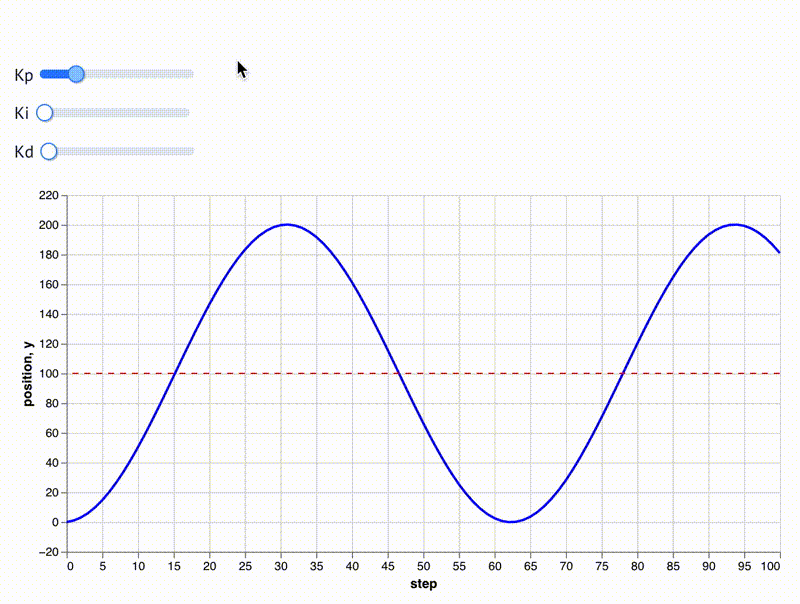

# ccl

Common Controls Library (CCL)

## Prerequisites

- CMake 3.15+
- C++17 compiler
- uv (Python package manager)

## Setup

```bash
# Configure CMake
cmake -B build -DCMAKE_INSTALL_PREFIX=build/install

# Build C library and tests
make build.core

# Build C++ library and tests
make build.cpp

# Install Python package in development mode
make build.py
```

## Testing

```bash
# Run C tests
make test.core

# Run C++ tests
make test.cpp

# Run Python tests
make test.py
```

## Development

```bash
# Remove build artifacts
make clean

# Open marimo notebook
make notebook
```

## Video Demonstration



## Project Structure
```
ccl/
├── core/              # C source and header files
├── cpp/               # C++ source and header files
├── notebooks/         # Marimo notebooks
├── python/ccl/        # Python package with bindings
├── tests/             # C, C++, and Python tests
└── CMakeLists.txt
```